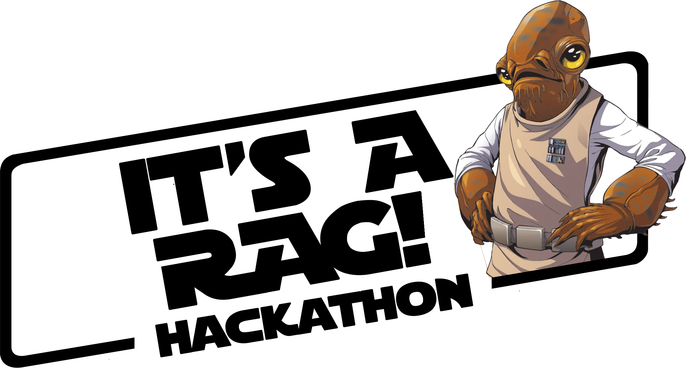

# It's a RAG! Hackathon

  

## Workflow

This repository is used to develop, test and produce repositories to support 
Gen AI Hackathons. It is meant to be a place where the hackathon content is
developed and stored. It is NOT meant to be used AS-IS by hackathon participants.
Hackathon content needs to be exported from this repository into a clean repository 
before being used.

We created a script that free up the solution content so that the repo can easely be moved to the public repo.

## Content Creators and Owners

This hackathon was created with the work of many Microsofties, spending hours of their time to make it happen.
**Be fair and give credit where credit is due.**

Sharing is caring, and we are sharing this content with you. Thanks for the credit.

<table>
   <tr>
    <td align="center">
      <a href="https://github.com/francesco-sodano" title="Francesco Sodano's GitHub Profile">
         
        <strong>Francesco SODANO</strong>
         
        📢
      </a>
    </td>
    <td align="center">
      <a href="https://github.com/dbroeglin" title="Dominique Broeglin's GitHub Profile">
         
        <strong>Dominique BROEGLIN</strong> 
        📢
      </a>
    </td>
    <td align="center">
      <a href="https://github.com/cweo" title="Johan Bartas' GitHub Profile">
         
        <strong>Johan BARTHAS</strong> 
        📢
      </a>
    </td>
    <td align="center">
      <a href="https://github.com/abossard" title="Andre Bossard's GitHub Profile">
         
        <strong>Andre BOSSARD</strong> 
        📢
      </a>
    </td>
    <td align="center">
      <a href="https://github.com/piizei" title="Petteri Johansson's GitHub Profile ">
         
        <strong>Petteri JOHANSSON</strong> 
        📢
      </a>
    </td>
    <td align="center">
      <a href="https://www.linkedin.com/in/christine-traver-97381329/" title="Christine Traver's LinkedIn Profile">
         
        <strong>Christine TRAVER</strong> 
        📢
      </a>
    </td>
</tr></table>

## Contributing

We strive to make it so that anyone who wants to contribute can open a Codespace or DevContainer
on this repository and should be ready to go.

The participant directories like `its-a-rag` also contain a `.devcontainer` directory. This 
DevContainer directory is meant for participants. When the container is ready it should contain 
everything we want the participants to have ready to start hacking. It may ommit dependencies or 
tools that we want them to install.

