# Challenge 2: Play with Azure AI Foundry

## Introduction

In this challenge, you will interact with Azure AI Foundry, a web portal that consolidates various Azure AI services into a single, cohesive development environment. From here you will be able to deploy models and infer with the vanilla models in the Playground.
After that, you will add some of the data provided in the dataset and perform some queries to the models.

The two models that you will interact with are:

- Azure OpenAI GPT4o
- Phi-3-medium-128k-instruct (only if you are using Sweden Central as location)

### What is Azure AI Foundry?

The increasing adoption of artificial intelligence (AI), particularly generative AI, is driving the need for developers to build comprehensive AI solutions. These solutions must integrate machine learning models, AI services, prompt engineering, and custom code. While Microsoft Azure offers a variety of services for creating AI solutions, developers have traditionally had to juggle multiple tools and web portals within a single project.
Azure AI Foundry simplifies this process by unifying features from Azure Machine Learning, Azure OpenAI, and other Azure AI services into one centralized workspace. This allows developers to collaborate seamlessly with data scientists and other team members in building AI solutions.

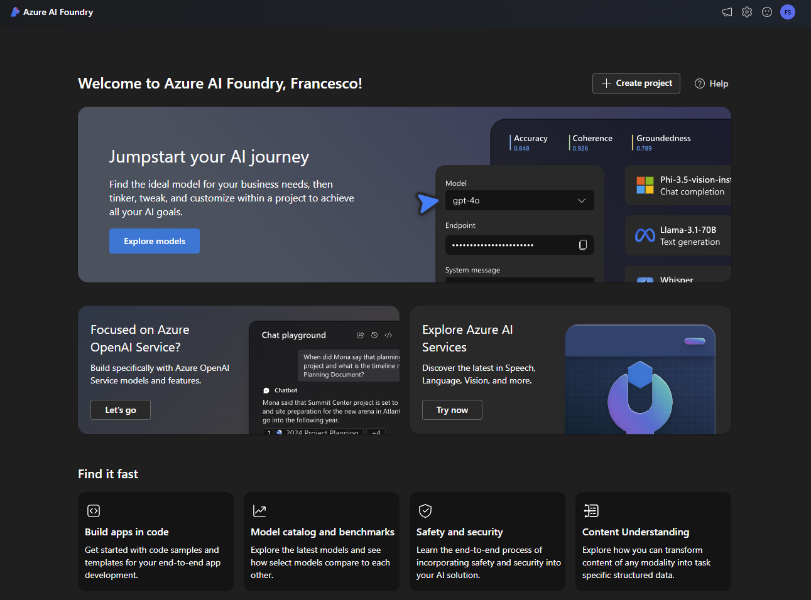

Specifically, Azure AI Foundry integrates:

- The model catalog and prompt flow development features from Azure Machine Learning.
- The deployment, testing, and custom data integration capabilities for generative AI models from Azure OpenAI service.
- Integration with Azure AI Services for speech, vision, language, document intelligence, and content safety.

Beyond offering a unified interface for these AI services, Azure AI Foundry also supports:

- Creating Azure AI hubs, which serve as collaborative development workspaces for data scientists, developers, and other stakeholders to build AI solutions.
- Managing assets and code for specific solutions within dedicated projects.
- Scalable, on-demand compute resources.
- Seamless integration with data sources and other cloud services.
- Web-based environments for code development.
- SDKs and CLI libraries for automation.

Azure AI Foundry enables teams to collaborate efficiently and effectively on AI projects, such as developing custom copilot applications that use large language models. Tasks you can accomplish with Azure AI Foundry include:

- Deploying models from the model catalog to real-time inferencing endpoints for client applications to consume.
- Deploying and testing generative AI models in an Azure OpenAI service.
- Integrating data from custom data sources to support a retrieval augmented generation (RAG) approach to prompt engineering for generative AI models.
- Using prompt flow to define workflows that integrate models, prompts, and custom processing.
- Integrating content safety filters into a generative AI solution to mitigate potential harms.
- Extending a generative AI solution with multiple AI capabilities using Azure AI services.

---

## Challenge

This challenge focuses on using the Azure AI Foundry to interact with the models and the data provided in the dataset.
The challenge is composed by the following steps:

- **Step 1**: Create a Project in Azure AI Foundry
- **Step 2**: Deploy the required LLM Models
- **Step 3**: Use the Azure AI Foundry Playground with the vanilla models
- **Step 4**: Deploy the additional required services
- **Step 5**: Add some of the data provided in the dataset
- **Step 6**: Create the index and perform embeddings
- **Step 7**: Use the Azure AI Foundry Playground with the new data

Here are the high-level steps to complete this challenge:

### Step 1. Create a Project in Azure AI Foundry

After the deployment is completed, you need to create a project in the Azure AI Foundry. You can do this by accessing the Azure AI Foundry from the Azure Portal.

**Q:** *What are the main reasons to have different projects in the same hub?*

### Step 2. Deploy the required LLM Models

In the Azure AI Foundry, you can deploy models from the model catalog to real-time inferencing endpoints for client applications to consume. For this challenge, you need to deploy the following models under the project created in the previous step:
   - Azure OpenAI GPT4o (gpt-4o | serverless API) - Global Standard - Version 2024-08-06 - **100k Tokens per minute**
   - Phi-3-medium-128k-instruct (serverless API)

**Q:** *What are the main differences between serverless and Managed Compute? Why do we suggest deploying serverless for a RAG implementation?*
**Q:** *What are the main differences between the two models? Also, consider costs. What other model would you suggest using for a simple RAG?*

### Step 3. Use the Azure AI Foundry Playground with the vanilla models

Now that you have the models deployed, you can use the Azure AI Foundry Chat Playground to interact with the models.

the first step is to customize the **model instructions and context**: put something meaningful for the task you would like to achieve and related with your questions/data.
For example, you can use the following instructions and context to **Generate** Automatically the prompt for the GPT4o model in case you are using the FSI dataset:

`You are a financial assistant tasked with answering questions related to the financial results of major technology companies listed on NASDAQ, specifically Microsoft (MSFT), Alphabet Inc. (GOOGL), Nvidia (NVDA), Apple Inc. (AAPL), and Amazon (AMZN).`


> [!IMPORTANT]  
> The next questions only apply if you are using the provided dataset. If you are using your own dataset, you have to create your own questions.

Try to ask the following questions on all models deployed:

 - What are the revenues of GOOGLE in the year 2009?
 - What are the revenues and the operative margins of ALPHABET Inc. in 2022 and how it compares with the previous year?
 - Can you create a table with the total revenue for ALPHABET, NVIDIA, MICROSOFT and APPLE in year 2023?
 - Can you give me the Fiscal Year 2023 Highlights for APPLE, MICROSOFT and NVIDIA?
 - Did APPLE repurchase common stock in 2023? create a table of APPLE repurchased stock with date, numbers of stocks and values in dollars.
 - What is the value of the cumulative 5-years total return of ALPHABET Class A at December 2022?
 - What was the price of APPLE, NVIDIA and MICROSOFT stock in 23/07/2024?
 - Can you buy 10 shares of APPLE for me?

- What are the revenues of GOOGLE in the year 2009?
- What are the revenues and the operative margins of ALPHABET Inc. in 2022 and how it compares with the previous year?
- Can you compare and create a table with the revenue of ALPHABET Inc., NVIDIA, MICROSOFT, APPLE and AMAZON in years 2023?
- Can you give me the Fiscal Year 2023 Highlights for APPLE, MICROSOFT, NVIDIA and ALPHABET?
- Did APPLE repurchase common stock in 2023? create a table of APPLE repurchased stock with date, numbers of stocks and values in dollars.
- What is the value of the cumulative 5-years total return of ALPHABET Class A at December 2022?
- What was the price of APPLE, NVIDIA and MICROSOFT stock in 23/07/2024?
- Can you buy 10 shares of APPLE for me?

### Step 4. Deploy the additional services required

Now, after you compared the models and the answers, let's provide additional data sources to the models.
To be able to do that and create the first version of your RAG Playground, you need some other components:

- A retrieval service: to be able to search the data and provide it to the models.
- An embedding model: to be able to vectorize the data and capture its semantic meaning.
- A vector database and index: to store the vectorized data and make it searchable.

In this step, you need to deploy and configure the following services:

> [!NOTE]
> If you used the Bicep template to deploy the Azure AI Foundry, you already have the Azure AI Search and a blob storage for data deployed in your resource group. You still need to deploy the Embedding Model.

- The OpenAI model "text-embedding-ada-002": this will be our Embedding Model.
- Azure AI Search: this will be our retrieval service and VectorDB. (already deployed if you used the bicep template)
- A Blob Storage Account: this is where the indexes will be stored. (already deployed if you used the bicep template)

For the Embedding Model, be sure you assign at **least 100k Tokens per minute**.

### Step 5. Add some of the data provided in the dataset

With all the services deployed, you need to add some of the data provided (```its-a-rag/data/fsi/pdf/```) in the dataset to the Azure AI Search and Blob Storage.
The high-level steps to complete are:

- Identify the Blob Storage account with the name including <\*data\*> (exact name depends from your environment)
- Create a container named 'data' in the Blob Storage account (Private).
- Import the following file in a folder called '2023':
    - *2023 FY AMZN.pdf*
    - *2023 FY AAPL.pdf*
    - *2023 FY GOOGL.pdf*
    - *2023 FY MSFT.pdf*
    - *2023 FY NVDA.pdf*

  You can use the Azure Portal (preferred) or the Azure Storage Explorer to upload the files.

- Add CORS rules to the Blob Storage. (`https://mlworkspace.azure.ai,https://ml.azure.com,https://*.ml.azure.com,https://ai.azure.com,https://*.ai.azure.com`- ALL except MERGE -  remember to allow all headers)

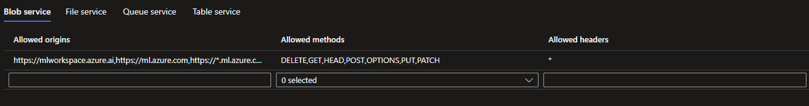


- Add a connection for the data source to the Azure AI Foundry.

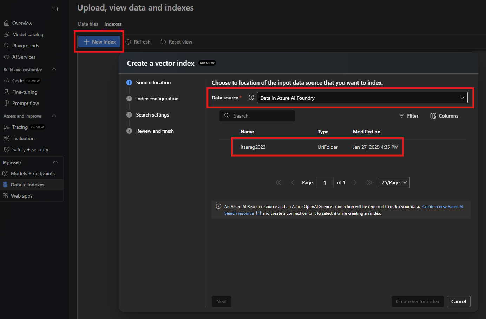

- For the AI Studio Hub Managed identity, AI Studio Project grant permission to the Blob Storage (Blob Storage Data Contributor).

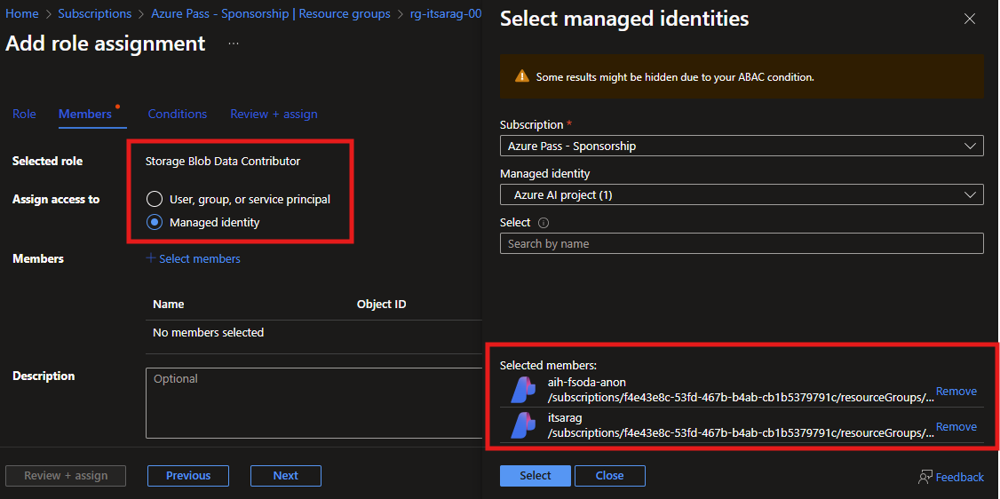


> **ATTENTION:** 
> Due to a limitation (this is a preview feature) in the Azure AI Foundry, **you need to change Firewall rule for the Public Network Access on BOTH the Blob Storage Accounts to "Enabled from All Networks"**.


> 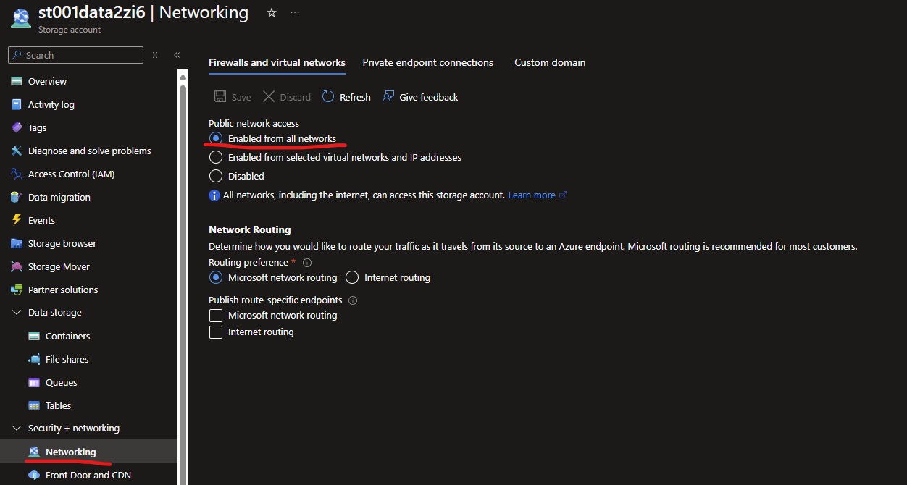


> Also, you need to enable for **BOTH** Storage accounts the **Allow storage account key access** in Settings -> Configuration.


> 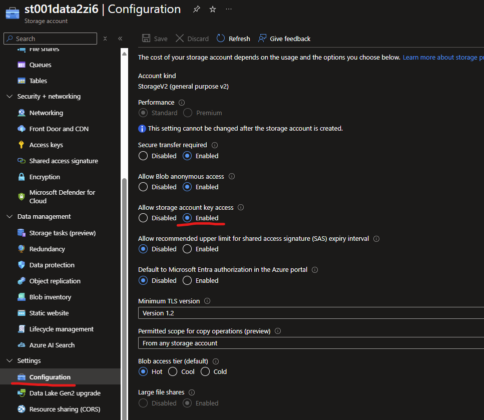


### Step 6. Create the index and perform embeddings

Now we need to create the index and perform embeddings for the data imported in Azure AI Studio Foundry.

Go to the Azure AI Studio Foundry and create a new index:

- Be sure you Select to create a new index based on the data already connected to Azure AI Foundry.
- Be sure that you select the Azure AI Serach Service that was created in the previous steps.
- We suggest also to call your index `itsarag-aifoundry-001` to avoid any confusion with the next challenges.
- Add a vector search to your search resource.

> **NOTE:** 
> The indexing will take up to **10 minutes** to complete.

### Step 7. Use the Azure AI Foundry Playground with the new data

Now that you have your data indexed, let's try to ask the same questions as before in the Azure AI Foundry Playground Chat.

Be sure you enable "Hybrid (vector + keyword)" search to improve the results.

Try to ask again **the same questions as before** and see how the answers compare.

Be sure you adjust the Parameters in the right way. Some example:
- Strictness (1-5): 3
- Retrieved documents (3-20): 10
- Past message included: 1 (has we don't need history)
- Max response: 2800

**Q:** *What are the main differences between the answers now and before?*

Continue to play with the Azure AI Foundry and the models deployed asking addtional questions based on the document provided.

**Q:** *Did you find any limitations, hallucinations or missing answer even if the document contains the information?*

---

## Success Criteria

- You have the Azure AI Foundry fully operational with vanilla models and with the ability of adding your own data.
- You have answered all the questions provided and able to explain the behavior of the coaches.

## Resources

* [Introduction to Azure AI Foundry](https://learn.microsoft.com/en-us/training/modules/introduction-to-azure-ai-studio)
* [Explore and deploy models from the model catalog in Azure AI Foundry](https://learn.microsoft.com/en-us/training/modules/explore-models-azure-ai-studio/)
* [Build a RAG-based copilot solution with your own data using Azure AI Foundry](https://learn.microsoft.com/en-us/training/modules/build-copilot-ai-studio/)
* [Content retrieval in Azure AI Search](https://learn.microsoft.com/en-us/azure/search/retrieval-augmented-generation-overview#content-retrieval-in-azure-ai-search)
* [Azure OpenAI Service documentation](https://learn.microsoft.com/en-us/azure/ai-services/openai/)
* [Azure AI Search documentation](https://learn.microsoft.com/en-us/azure/search/)
* [Azure AI Search Skillset concepts](https://learn.microsoft.com/en-us/azure/search/cognitive-search-working-with-skillsets)

<!-- BEGIN SOLUTION -->
## Solution

### Step 1. Create a Project in Azure AI Studio.

Go to https://ai.azure.com or access it from the Azure Portal as below: 

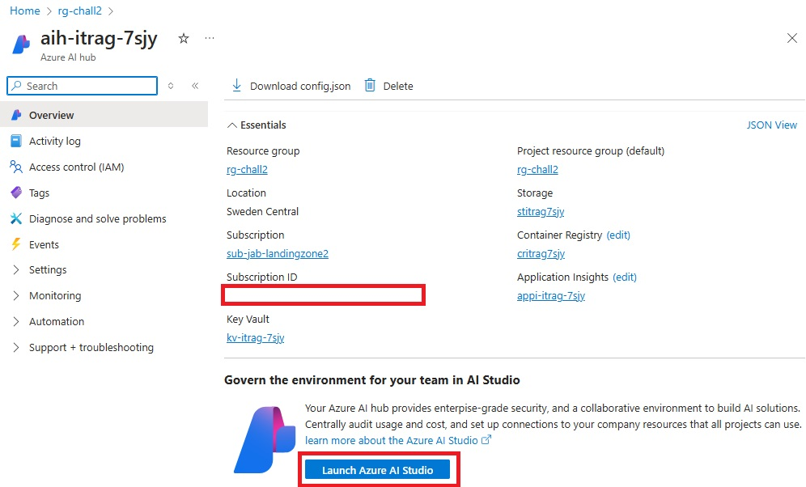

Create a project as below - with the project name of your choice:


**Q: What are the main reasons to have different projects in the same hub?**

Having multiple projects in a single Azure AI Hub offers several benefits:
* __Centralized Management:__ Hubs provide a central way to govern security, connectivity, and computing resources across all projects. This ensures consistent security settings and shared resource access.
* __Resource Sharing:__ Projects within a hub can easily share company resources such as data, model endpoints, and repositories. This reduces the need for repeated IT intervention and speeds up development.
* __Data Isolation:__ Each project can isolate its data, ensuring that sensitive information is only accessible to authorized team members.
* __Billing and Access Management:__ Projects help keep track of billing and manage access, making it easier to allocate costs and control who can access specific resources.
* __Rapid Prototyping:__ Developers can quickly create project workspaces for prototyping, building, and operating AI applications without waiting for IT to set up new environments.
* __Compliance and Customization:__ Hubs can be customized to meet organizational compliance requirements, including networking, identity, encryption, and monitoring.

These benefits collectively enhance productivity, security, and collaboration within teams working on AI projects.

### Step 2. Deploy the LLM Models required

We focus here on the GUI method.
#### Deploy process for gpt-4o
From the project you just created, go to the model catalog and search for gpt-4o:

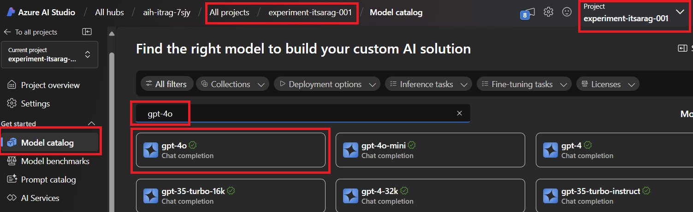

Click and hit Deploy:

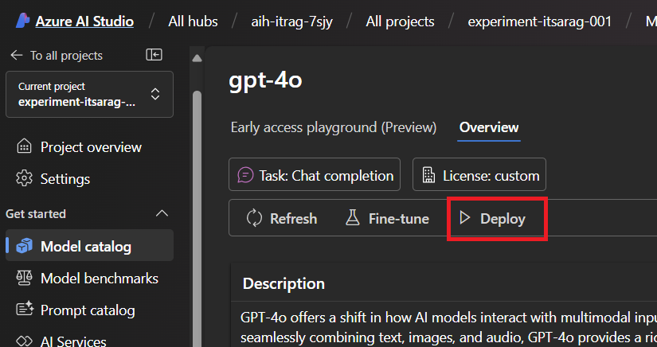

Click customize and set the token per minutes (tpm) to 50k. You can keep the name as gpt-4o for simplicity sake:

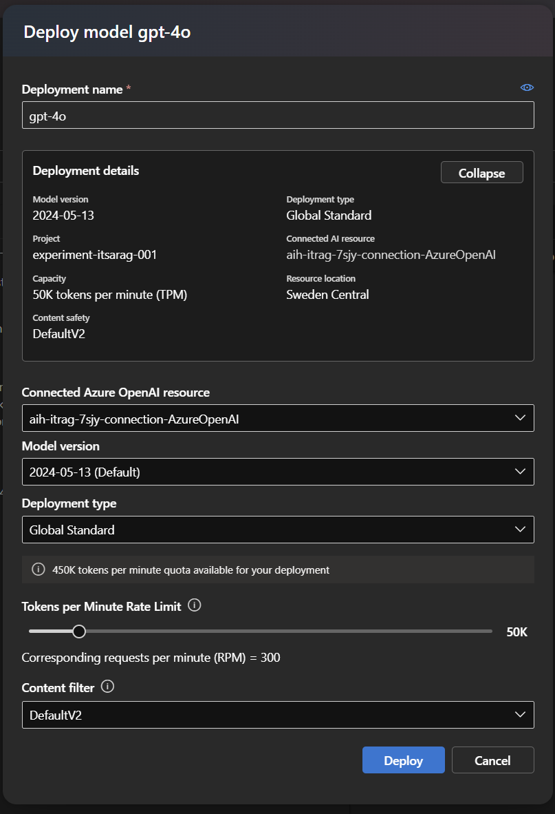

#### Deploy phi-3-medium-128k-instruct
Replicate the ```gpt-4o``` deploy process for ```phi-3-medium-128k-instruct``` with __???__ tpm - select with serverless api and content filter (preview).

**Q: What are the main differences between serverless and Managed Compute? Why we suggested to deploy serverless for a RAG implementation?**

__Serverless API Model__
The serverless API model is ideal for scenarios where you want to deploy models quickly and efficiently without worrying about infrastructure management. This model provides a pay-as-you-go billing system, which means you only pay for the actual usage of the API. It is particularly useful for:

* __Rapid Prototyping:__ Quickly deploying models for testing and validation without the need for extensive setup.
* __Cost Efficiency:__ Paying only for the actual usage, making it cost-effective for applications with variable or unpredictable traffic.
* __Scalability:__ Automatically scaling to handle varying loads without manual intervention.
* __Simplicity:__ Reducing the complexity of managing infrastructure, allowing you to focus on developing and deploying models.

__Managed Compute API Model__
The managed compute API model is suitable for scenarios where you need more control over the computing resources and infrastructure. This model allows you to allocate dedicated resources for your models, providing consistent performance and reliability. It is particularly useful for:

* __High-Performance Requirements:__ Ensuring consistent and high performance for applications with steady and predictable workloads.
* __Resource Control:__ Having control over the computing resources, which can be essential for optimizing performance and cost.
* __Customization:__ Customizing the infrastructure to meet specific requirements, such as compliance, security, and performance tuning.
* __Long-Term Projects:__ Deploying models that require long-term stability and reliability, with dedicated resources to support them.

In the context of a RAG implementation, it can be inpredictable at first: ranging from periods of zero usage, to periods of high usage where scalibility is key. Serverless allows you to have a cost efficient solution that can scale up and down with the demand. Besides, in the context of our experiment, it's the most adapted due to the simplicity of deployment, and the cost efficiency.

**Q: What are the main differences between the two models? keep also in consideration costs. What other model(s) would you suggest to use for a simple RAG?**

The main differences between Phi-3 and GPT-4o are as follows:

__Model Type and Capabilities:__
* __Phi-3:__ This is a family of small language models (SLMs) developed by Microsoft. Phi-3 models are designed to be efficient, cost-effective, and optimized for personal devices. The Phi-3-vision model, for example, offers the ability to input images and text and receive text responses.
* __GPT-4o:__ This is a large language model (LLM) developed by OpenAI. GPT-4o is a multimodal model that integrates text, vision, and audio processing in a single model. It sets a new standard for generative and conversational AI experiences by enhancing accuracy and responsiveness in human-computer interactions.

__Performance and Use Cases:__
* __Phi-3:__ Phi-3 models are known for their efficiency, speed, and domain-specific performance. They are particularly suitable for targeted applications where resource constraints are a consideration.
* __GPT-4o:__ GPT-4o achieves state-of-the-art performance on visual perception benchmarks and is designed for real-time and more natural interactions. It is especially better at vision and audio understanding compared to existing models.

__Cost and Scalability:__
* __Phi-3:__ Phi-3 models are cost-effective and optimized for personal devices, making them suitable for applications where cost and resource efficiency are important.
* __GPT-4o:__ GPT-4o offers a more capable, speedier, and cost-effective option for customers looking to use a more advanced LLM. It is designed to be scalable and can handle large-scale applications.

Other __example__ models could be from the Azure AI Studio model catalog: Meta-Llama-3.1-8B-Instruct as a SLM option, and Mistral Large as a LLM option.

### Step 3. Use the Azure AI Studio Playground with the vanilla models

Go to Project playground -> Chat, and ask the questions by selecting iteratively the two models as below:

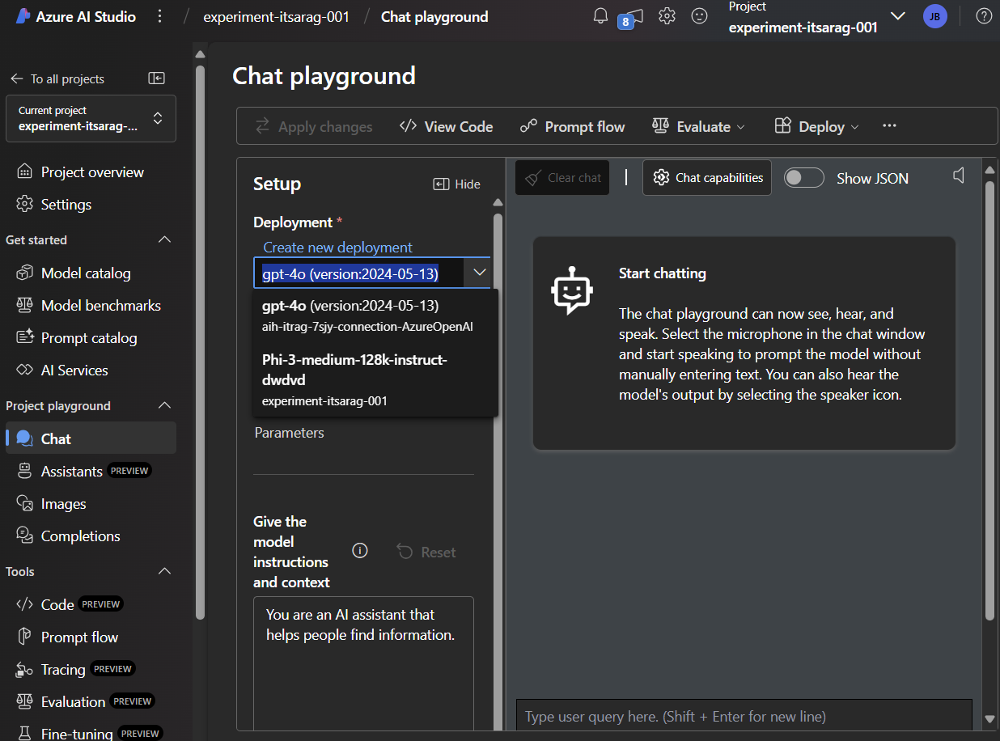


**Q: How the answers compare?**

While ```phi-3-medium-128k-instruct``` gives lengthy answers. The data displayed is inaccurate, while the syntax is good. In other terms, Phi-3-medium answers are more susceptible of showing hallucination due in part, to the smaller size of the model. ```Gpt-4o``` is more accurate, however due to the temporarility of the data it was trained on, it cannot answer questions of recent events: for e.g., it doesn't have the answer for the first question on the 2023 data point.

To be able to get an accurate chatbot, we need to ground the answers by providing the models access to real data.

### Step 4. Deploy the additional services required

Go to the model catalog and deploy text-embedding-ada-002 following the same process as before, you can keep the default setting of 120k tpm:

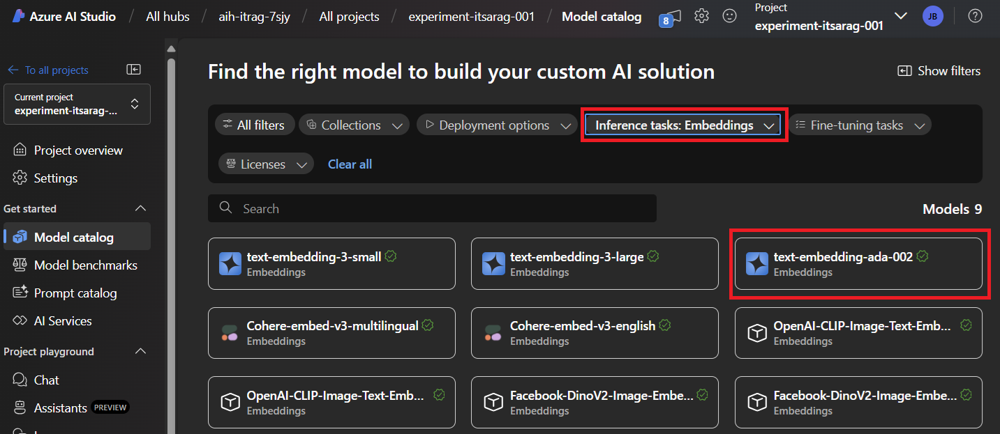
 
### Step 5. Add some of the data provided in the dataset and perform some queries to the models

#### Creating a container in the \*ragdata\* storage account
Go back to the Azure Portal and select the \*ragdata\* storage account and create a container named `data` following those steps:


#### Uploading data into the container
Upload the data files as in the guide:

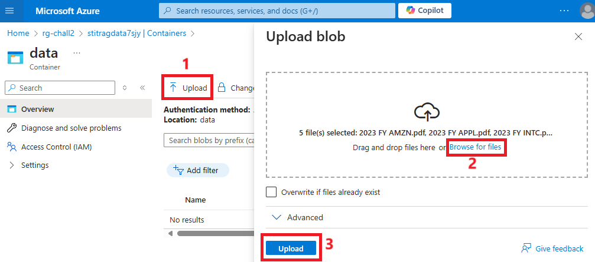

#### Adding CORS to the storage account
Go to CORS.

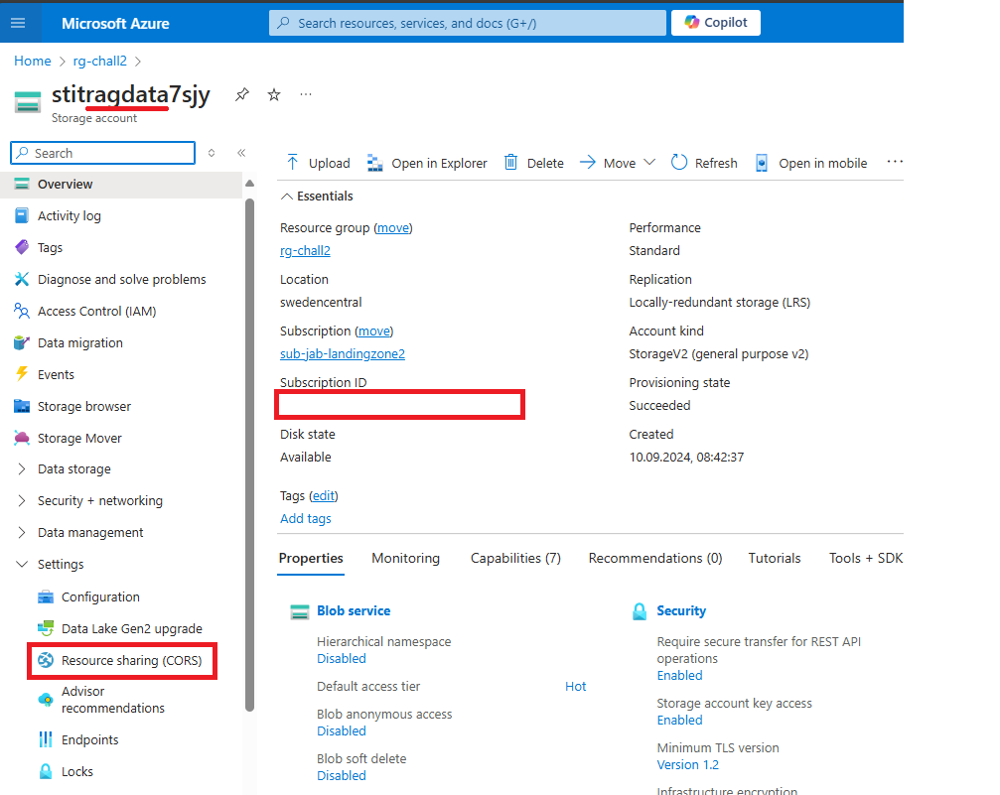

Add the provided links in the allowed origins case with all allowed methods _EXCEPT MERGE_.

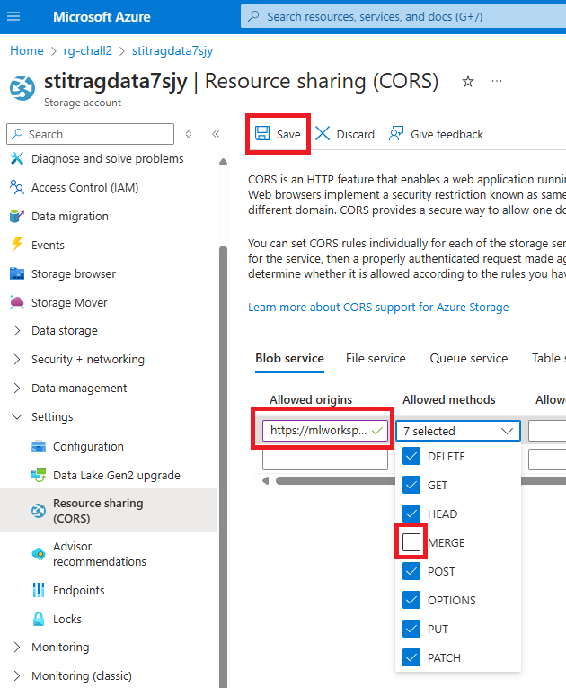


#### Add a connection for the data source to the Azure AI Studio
Go back to Azure AI Studio and make sure you're still in the project you created in Step 2, and add a data source:

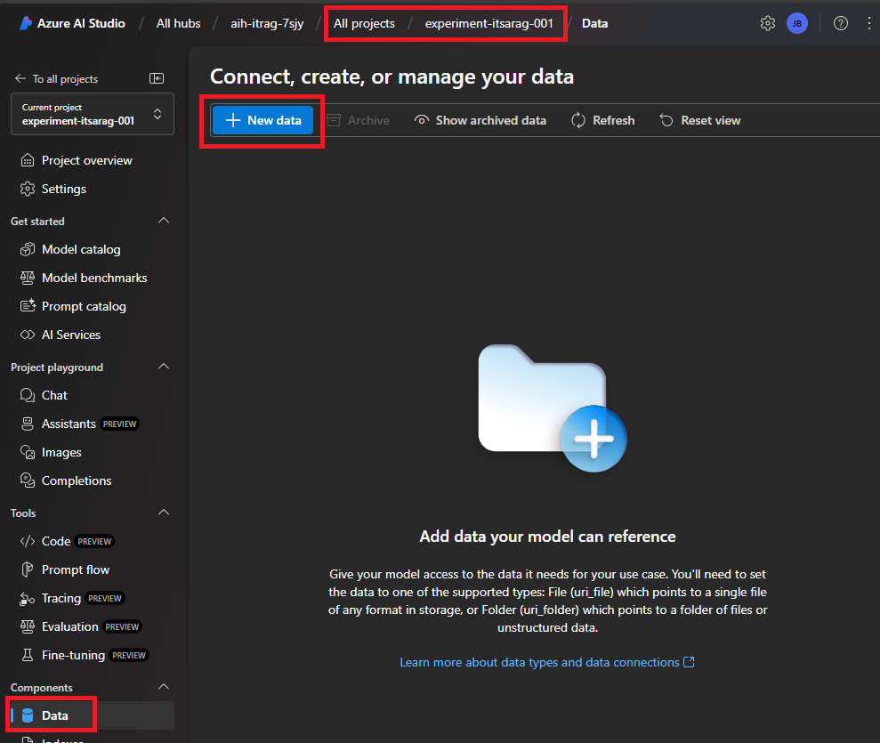

Create a connection and make sure to select Entra ID authentication for optimal security:


When done creating the connection, select Storage path as ```**/*```.

__Note:__ It's normal at this stage to not be able to see any data as we didn't yet authorize our Hub/project to access the storage account data.

#### Add a permission for the AI Studio Hub Managed identity and AI Studio Project Managed identity to the Blob Storage (Blob Storage Data Contributor)

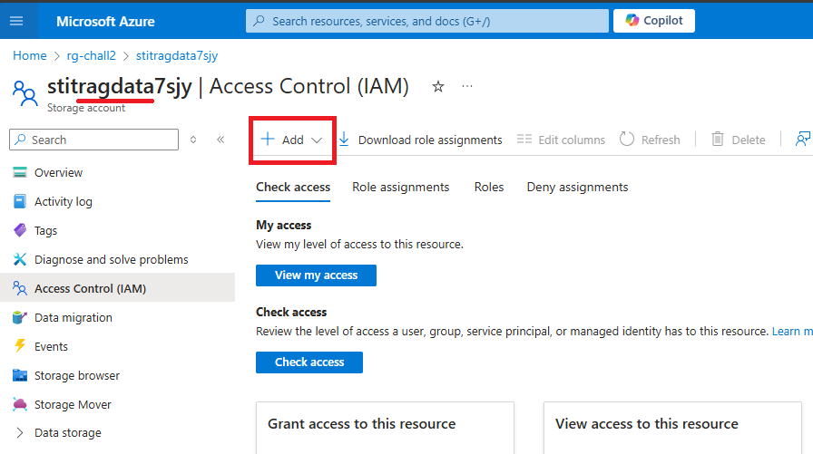


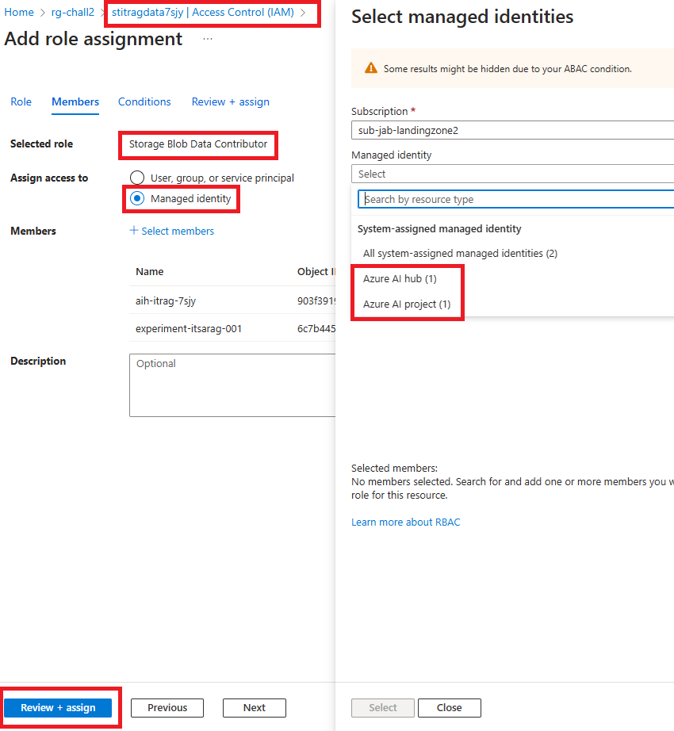

>__Important:__ Replicate the same with the Storage Blob Data Reader role on yourself.

#### Index your the data that you imported in the storage account.
Follow guidance here to finish the setup: https://learn.microsoft.com/en-us/azure/ai-studio/how-to/index-add.

Make sure to:
- Select Source data: _Data in Azure AI Studio_ and select the data source that you just imported.
- Select Autoselect for indexing compute.
- Enable vector search.

### Step 6. Use the Azure AI Studio Playground with the new data

Once indexing is done, go back to the Chat Playground, select in Add your data, the index you just created.
Search type should be set to hybrid in this scenario for best recall & precision.

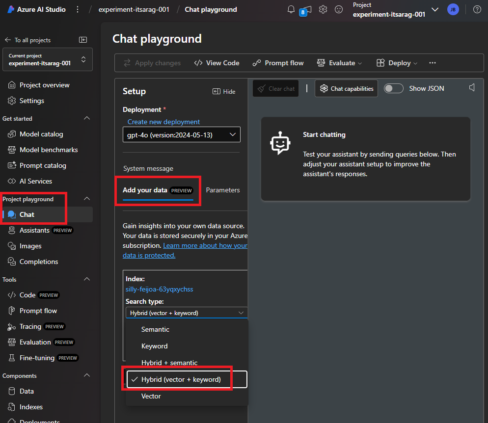

**Q: What are the main differences between the answers now and before?**

The answers are now grounded, and by default, restricted to what is in the vector database.
It makes using this chat more trustworthy as we are able to fact check what is returned.

An edge case of restricting answers to what is in the vector DB is not getting an answer at all.
<!-- END SOLUTION -->